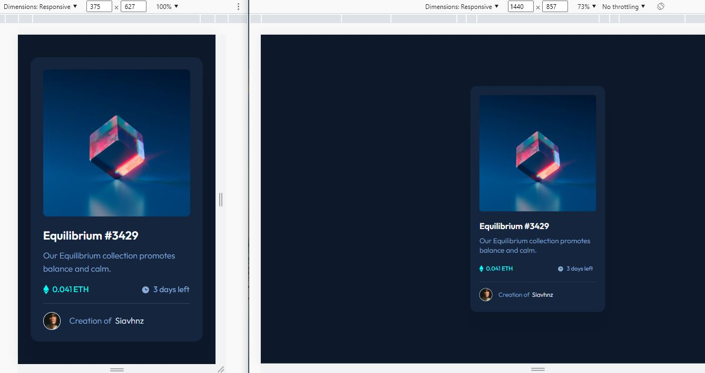

# Frontend Mentor - NFT preview card component solution

This is a solution to the [NFT preview card component challenge on Frontend Mentor](https://www.frontendmentor.io/challenges/nft-preview-card-component-SbdUL_w0U).
## Table of contents

- [Overview](#overview)
  - [The challenge](#the-challenge)
  - [Screenshot](#screenshot)
  - [Links](#links)
- [My process](#my-process)
  - [Workflow](#workflow)
  - [Built with](#built-with)
  - [What I learned](#what-i-learned)
  - [Continued development](#continued-development)
  - [Useful resources](#useful-resources)
- [Author](#author)
- [Acknowledgments](#acknowledgments)

## Overview

### The challenge

Users should be able to:

- View the optimal layout depending on their device's screen size
- See hover states for interactive elements

### Screenshot



### Links

- Solution: [frontendmentor.io](https://your-solution-url.com)
- Live Site: [github.io](https://siavhnz.github.io/frontendmentor/2.nft-preview/index.html)

## My process

### Workflow
 - Set up the project
 - Create the skeleton of the HTML file
 - mobile-first design
 - Desktop design
 - Compelete README.md file
 - Push solution on github.com
 - Publish solution on github.io and frontendmentor.io


### Built with

- Semantic HTML5 markup
  - main, article, figure, footer, address
- CSS custom properties
- Flexbox

### What I learned
1.

>"HTML should be coded to represent the data that will be populated and not based on its default presentation styling. Presentation (how it should look), is the sole responsibility of CSS."
> --<cite>[MDN][1]</cite>


I read [MDN Semantics article](https://developer.mozilla.org/en-US/docs/Glossary/Semantics) and tried to use semantic HTML5 markup.

Other great stuff on this topic: [HTML elements reference](https://developer.mozilla.org/en-US/docs/Web/HTML/Element), [Content categories](https://developer.mozilla.org/en-US/docs/Web/Guide/HTML/Content_categories), and [WHATWG Specification](https://html.spec.whatwg.org/#how-to-read-this-specification)

2.

I Learned how to create an image with an overlay without losing the opacity of elements.

First use a rgba instead of rgb to control the opacity of overlay tags

```
:root {
  --overlay: rgba(0, 255, 247, .5);
}
```
Second use position relative for image container

```
.card .img-effect{
  position: relative;
}
```

Finally style the overlay container

```.card .img-effect .overlay{
  display: flex;
  align-items: center;
  justify-content: center;
  border-radius: 8px;
  background-color: var(--overlay);
  position:absolute;
  height: 100%;
  width: 100%;
  overflow: hidden;
  transition: opacity 0.5s;
  opacity: 0;
}
.card .img-effect:hover .overlay{
  cursor: pointer;
  opacity:1;
  transition: opacity 0.5s;
}
```

### Continued development

I got better at using flexbox and relative values but I need more practice to grasp completely all the concepts that these attributes offer. Also, I need to read more about HTML5 semantics to create a better HTML skeleton.

### Useful resources

- [MDN Semantics article](https://developer.mozilla.org/en-US/docs/Glossary/Semantics) - To create a better HTML skeleton.
[Content categories](https://developer.mozilla.org/en-US/docs/Web/Guide/HTML/Content_categories) - This helped me to use the semantic HTML 5 elements where they were most proper.

## Author
- Frontend Mentor - [@siavhnz](https://www.frontendmentor.io/profile/siavhnz)

## Acknowledgments

[Frontendmentor.io](https://www.frontendmentor.io/challenges) for their Excitement challenges  

[Perfect Pixel](https://chrome.google.com/webstore/detail/perfectpixel-by-welldonec/dkaagdgjmgdmbnecmcefdhjekcoceebi?hl=en) for such a great extension

[1]: https://developer.mozilla.org/en-US/docs/Glossary/Semantics
